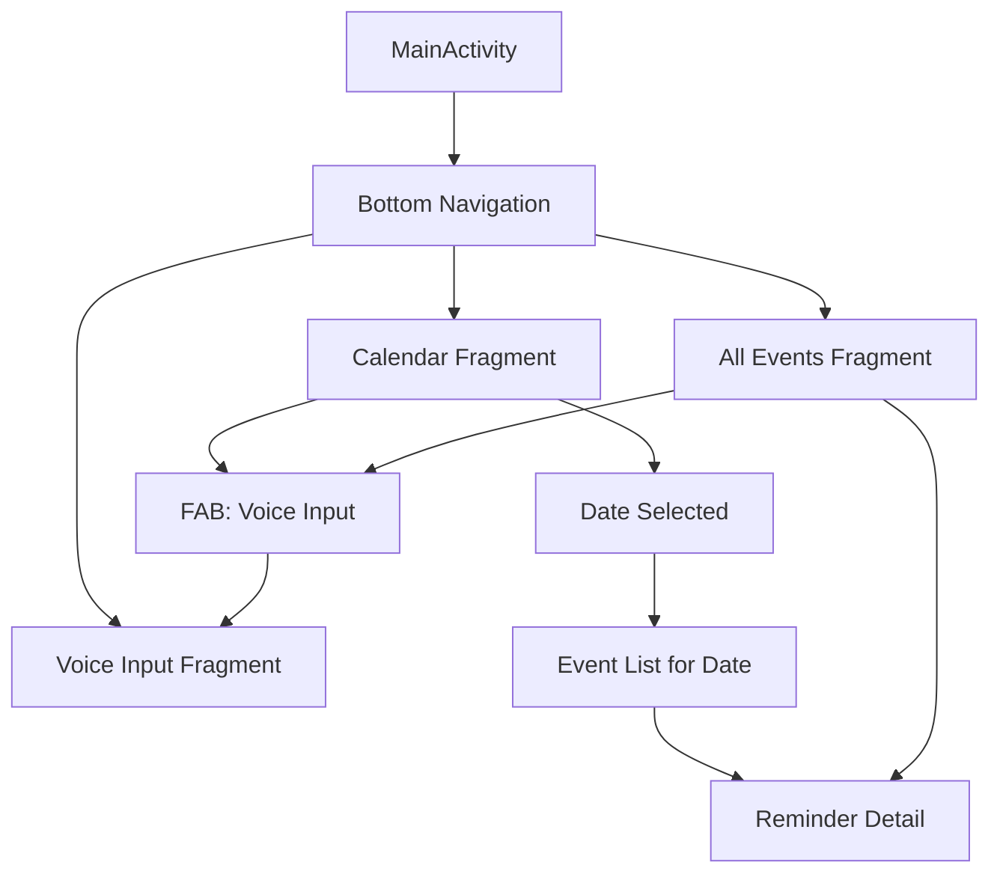
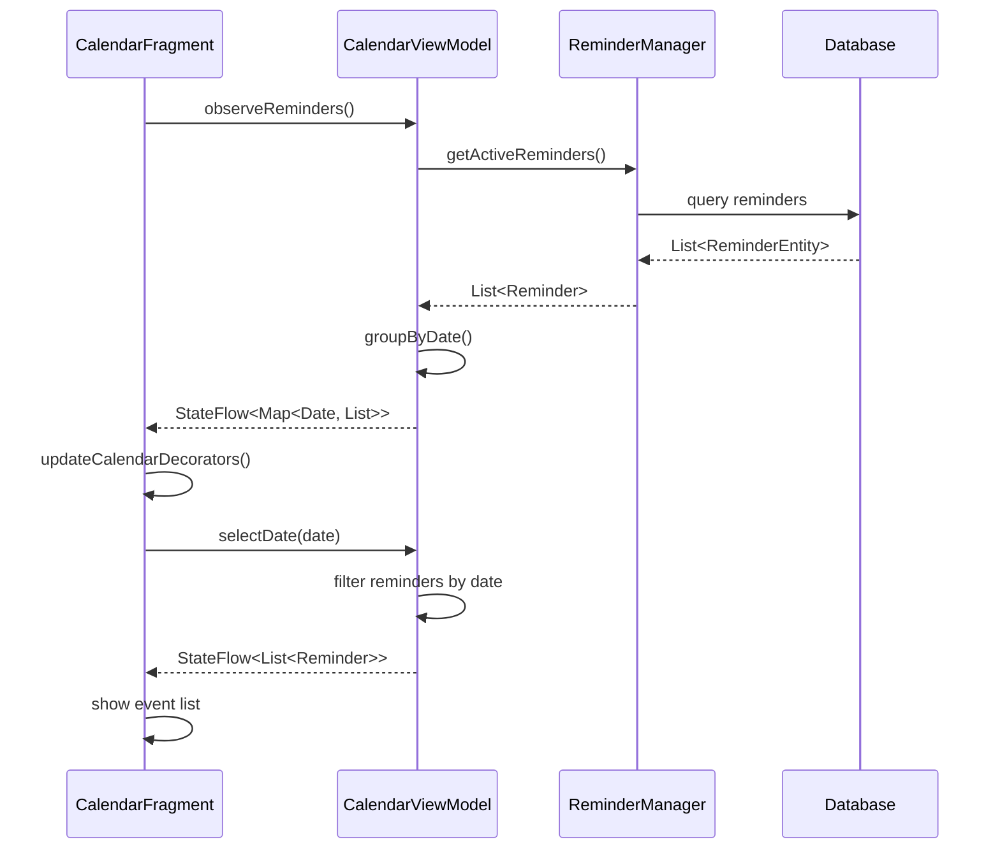

# Design Document: Calendar UI Enhancement

## Overview

The Calendar UI Enhancement adds visual reminder management capabilities to the Voice Reminder Assistant. This feature provides three main views: a monthly calendar with event indicators, a date-specific event list, and a comprehensive all-events list. The design integrates seamlessly with the existing voice-driven functionality while following Material Design 3 guidelines for Android.

The enhancement leverages existing data models and business logic from the voice reminder system, adding only presentation layer components. The calendar view uses a custom calendar widget or a third-party library, while event lists use RecyclerView for efficient rendering.

## Architecture

### Updated Application Architecture

```
┌─────────────────────────────────────────────────────────────────┐
│                     Presentation Layer (NEW)                     │
│  ┌──────────────┐  ┌──────────────┐  ┌──────────────┐          │
│  │CalendarFragment│ │EventListFrag │ │AllEventsFrag │          │
│  └──────────────┘  └──────────────┘  └──────────────┘          │
│  ┌──────────────┐  ┌──────────────┐                            │
│  │CalendarAdapter│ │EventAdapter  │                            │
│  └──────────────┘  └──────────────┘                            │
└─────────────────────────────────────────────────────────────────┘
                            │
┌─────────────────────────────────────────────────────────────────┐
│              Presentation Layer (EXISTING)                       │
│  ┌──────────────┐  ┌──────────────┐  ┌──────────────┐          │
│  │  MainActivity │  │ VoiceManager │  │ TTSManager   │          │
│  └──────────────┘  └──────────────┘  └──────────────┘          │
└─────────────────────────────────────────────────────────────────┘
                            │
┌─────────────────────────────────────────────────────────────────┐
│                      Domain Layer (EXISTING)                     │
│  ┌──────────────┐  ┌──────────────┐  ┌──────────────┐          │
│  │CommandParser │  │ReminderManager│ │NotificationMgr│          │
│  └──────────────┘  └──────────────┘  └──────────────┘          │
└─────────────────────────────────────────────────────────────────┘
```


### Navigation Flow



## Components and Interfaces

### 1. New Presentation Components

#### CalendarFragment
Fragment displaying the monthly calendar view with event indicators.

**Responsibilities:**
- Render monthly calendar grid
- Display event indicators on dates with reminders
- Handle date selection
- Navigate between months
- Observe reminder data changes

**Key Methods:**
```kotlin
class CalendarFragment : Fragment() {
    private lateinit var viewModel: CalendarViewModel
    private lateinit var calendarView: MaterialCalendarView
    
    fun onDateSelected(date: LocalDate)
    fun navigateToMonth(month: YearMonth)
    fun updateEventIndicators(reminders: List<Reminder>)
    private fun setupCalendar()
    private fun observeReminders()
}
```


#### EventListFragment
Fragment displaying reminders for a selected date.

**Responsibilities:**
- Display reminders for specific date
- Handle reminder card interactions
- Support swipe-to-delete
- Show empty state when no reminders

**Key Methods:**
```kotlin
class EventListFragment : Fragment() {
    private lateinit var viewModel: CalendarViewModel
    private lateinit var adapter: EventAdapter
    
    fun loadEventsForDate(date: LocalDate)
    fun onReminderClick(reminder: Reminder)
    fun onReminderDelete(reminder: Reminder)
    private fun setupRecyclerView()
}
```

#### AllEventsFragment
Fragment displaying all scheduled reminders across all dates.

**Responsibilities:**
- Display all reminders chronologically
- Group reminders by date
- Support filtering (pending/completed/all)
- Handle infinite scrolling for large datasets

**Key Methods:**
```kotlin
class AllEventsFragment : Fragment() {
    private lateinit var viewModel: CalendarViewModel
    private lateinit var adapter: AllEventsAdapter
    
    fun applyFilter(filter: ReminderFilter)
    fun onReminderClick(reminder: Reminder)
    private fun setupRecyclerView()
    private fun observeAllReminders()
}

enum class ReminderFilter {
    ALL, PENDING, COMPLETED
}
```


#### CalendarViewModel
ViewModel managing calendar and event data with lifecycle awareness.

**Responsibilities:**
- Fetch reminders from ReminderManager
- Provide LiveData/StateFlow for UI observation
- Handle reminder deletion
- Manage selected date state
- Filter and group reminders

**Key Methods:**
```kotlin
class CalendarViewModel(
    private val reminderManager: ReminderManager
) : ViewModel() {
    
    val allReminders: StateFlow<List<Reminder>>
    val selectedDateReminders: StateFlow<List<Reminder>>
    val selectedDate: StateFlow<LocalDate>
    
    fun selectDate(date: LocalDate)
    fun deleteReminder(reminderId: Long)
    fun getRemindersForMonth(yearMonth: YearMonth): Flow<Map<LocalDate, Int>>
    fun applyFilter(filter: ReminderFilter)
    
    private fun loadReminders()
    private fun groupRemindersByDate(reminders: List<Reminder>): Map<LocalDate, List<Reminder>>
}
```

#### EventAdapter
RecyclerView adapter for displaying reminder cards in lists.

**Responsibilities:**
- Bind reminder data to card views
- Handle click events
- Support swipe-to-delete
- Display different states (pending/completed)

**Key Methods:**
```kotlin
class EventAdapter(
    private val onReminderClick: (Reminder) -> Unit,
    private val onReminderDelete: (Reminder) -> Unit
) : RecyclerView.Adapter<EventAdapter.ReminderViewHolder>() {
    
    private var reminders: List<Reminder> = emptyList()
    
    fun submitList(newReminders: List<Reminder>)
    override fun onCreateViewHolder(parent: ViewGroup, viewType: Int): ReminderViewHolder
    override fun onBindViewHolder(holder: ReminderViewHolder, position: Int)
    
    inner class ReminderViewHolder(view: View) : RecyclerView.ViewHolder(view) {
        fun bind(reminder: Reminder)
    }
}
```


#### AllEventsAdapter
RecyclerView adapter with date headers for comprehensive event list.

**Responsibilities:**
- Display reminders grouped by date
- Render date header items
- Support multiple view types (header/reminder)
- Handle click and delete events

**Key Methods:**
```kotlin
class AllEventsAdapter(
    private val onReminderClick: (Reminder) -> Unit,
    private val onReminderDelete: (Reminder) -> Unit
) : RecyclerView.Adapter<RecyclerView.ViewHolder>() {
    
    private var items: List<EventListItem> = emptyList()
    
    fun submitList(reminders: List<Reminder>)
    override fun getItemViewType(position: Int): Int
    override fun onCreateViewHolder(parent: ViewGroup, viewType: Int): RecyclerView.ViewHolder
    
    sealed class EventListItem {
        data class Header(val date: LocalDate) : EventListItem()
        data class ReminderItem(val reminder: Reminder) : EventListItem()
    }
}
```

### 2. Updated MainActivity

MainActivity will be updated to host bottom navigation and manage fragment transactions.

**New Responsibilities:**
- Host BottomNavigationView
- Manage fragment transactions
- Coordinate FAB visibility
- Handle back navigation

**Updated Methods:**
```kotlin
class MainActivity : AppCompatActivity() {
    private lateinit var navController: NavController
    
    // Existing methods
    fun onVoiceButtonClick()
    fun onSpeechResult(text: String)
    
    // New methods
    fun setupBottomNavigation()
    fun navigateToFragment(destination: Int)
    fun showFab()
    fun hideFab()
}
```


## Data Models

### UI Models

The calendar UI will use existing domain models (Reminder, ReminderStatus) without modification. Additional UI-specific models:

```kotlin
// Date with event count for calendar indicators
data class CalendarDay(
    val date: LocalDate,
    val eventCount: Int,
    val hasEvents: Boolean = eventCount > 0
)

// Grouped reminders for all events view
data class ReminderGroup(
    val date: LocalDate,
    val reminders: List<Reminder>
)

// Filter state
enum class ReminderFilter {
    ALL,
    PENDING,
    COMPLETED
}
```

## User Interface Design

### Calendar View Layout

```
┌─────────────────────────────────────┐
│  ← November 2025 →                  │
├─────────────────────────────────────┤
│ Sun Mon Tue Wed Thu Fri Sat         │
│                  1   2   3   4      │
│  5   6   7   8   9  10  11          │
│ 12  13  14● 15  16  17  18          │
│ 19  20  21  22  23  24  25          │
│ 26  27  28  29  30                  │
├─────────────────────────────────────┤
│ Events for Nov 14                   │
│ ┌─────────────────────────────────┐ │
│ │ 🔔 2:00 PM                      │ │
│ │ Team meeting                    │ │
│ └─────────────────────────────────┘ │
│ ┌─────────────────────────────────┐ │
│ │ 🔔 5:30 PM                      │ │
│ │ Call dentist                    │ │
│ └─────────────────────────────────┘ │
└─────────────────────────────────────┘
        [Calendar] [List] [Voice]
                    🎤 FAB
```

### All Events View Layout

```
┌─────────────────────────────────────┐
│  All Events        [Filter: All ▼]  │
├─────────────────────────────────────┤
│ Today - Nov 15                      │
│ ┌─────────────────────────────────┐ │
│ │ 🔔 10:00 AM                     │ │
│ │ Morning standup                 │ │
│ └─────────────────────────────────┘ │
├─────────────────────────────────────┤
│ Tomorrow - Nov 16                   │
│ ┌─────────────────────────────────┐ │
│ │ 🔔 3:00 PM                      │ │
│ │ Doctor appointment              │ │
│ └─────────────────────────────────┘ │
│ ┌─────────────────────────────────┐ │
│ │ ✓ 6:00 PM (Completed)           │ │
│ │ Grocery shopping                │ │
│ └─────────────────────────────────┘ │
└─────────────────────────────────────┘
        [Calendar] [List] [Voice]
                    🎤 FAB
```


### Reminder Card Design

```xml
<!-- Pending Reminder Card -->
<MaterialCardView
    style="@style/Widget.Material3.CardView.Elevated"
    app:cardBackgroundColor="@color/surface">
    
    <LinearLayout orientation="vertical">
        <TextView 
            text="🔔 2:00 PM"
            style="@style/TextAppearance.Material3.TitleMedium"/>
        <TextView 
            text="Team meeting"
            style="@style/TextAppearance.Material3.BodyLarge"/>
    </LinearLayout>
</MaterialCardView>

<!-- Completed Reminder Card -->
<MaterialCardView
    style="@style/Widget.Material3.CardView.Outlined"
    app:cardBackgroundColor="@color/surface_variant">
    
    <LinearLayout orientation="vertical">
        <TextView 
            text="✓ 6:00 PM (Completed)"
            style="@style/TextAppearance.Material3.TitleMedium"
            android:textColor="@color/on_surface_variant"/>
        <TextView 
            text="Grocery shopping"
            style="@style/TextAppearance.Material3.BodyLarge"
            android:textColor="@color/on_surface_variant"/>
    </LinearLayout>
</MaterialCardView>
```

## Calendar Library Selection

### Option 1: Material Calendar View (Recommended)
- Library: `com.github.prolificinteractive:material-calendarview`
- Pros: Material Design, customizable, event decorators
- Cons: Requires custom decorator implementation

### Option 2: Android CalendarView (Native)
- Native Android widget
- Pros: No dependencies, simple
- Cons: Limited customization, older design

### Option 3: Custom Implementation
- Build from scratch using RecyclerView
- Pros: Full control, optimized
- Cons: Time-consuming, complex

**Decision: Use Material Calendar View** for faster implementation with good customization options.


## Implementation Details

### Calendar Event Indicators

Event indicators will be implemented using custom decorators:

```kotlin
class EventDecorator(
    private val dates: Set<LocalDate>,
    private val color: Int
) : DayViewDecorator {
    
    override fun shouldDecorate(day: CalendarDay): Boolean {
        return dates.contains(day.date.toLocalDate())
    }
    
    override fun decorate(view: DayViewFacade) {
        view.addSpan(DotSpan(8f, color))
    }
}

class MultiEventDecorator(
    private val dateCounts: Map<LocalDate, Int>
) : DayViewDecorator {
    
    override fun shouldDecorate(day: CalendarDay): Boolean {
        return dateCounts.containsKey(day.date.toLocalDate())
    }
    
    override fun decorate(view: DayViewFacade) {
        val count = dateCounts[day.date.toLocalDate()] ?: 0
        when {
            count > 5 -> view.setBackgroundDrawable(getDrawable(R.drawable.many_events_bg))
            count > 2 -> view.addSpan(DotSpan(12f, color))
            else -> view.addSpan(DotSpan(8f, color))
        }
    }
}
```

### Data Flow




### Swipe-to-Delete Implementation

```kotlin
class SwipeToDeleteCallback(
    private val onDelete: (Int) -> Unit
) : ItemTouchHelper.SimpleCallback(0, ItemTouchHelper.LEFT) {
    
    override fun onMove(...): Boolean = false
    
    override fun onSwiped(viewHolder: RecyclerView.ViewHolder, direction: Int) {
        val position = viewHolder.adapterPosition
        onDelete(position)
    }
    
    override fun onChildDraw(...) {
        // Draw red background with delete icon
        val background = ColorDrawable(Color.RED)
        val deleteIcon = ContextCompat.getDrawable(context, R.drawable.ic_delete)
        // Custom drawing logic
    }
}

// Usage in Fragment
val swipeHandler = SwipeToDeleteCallback { position ->
    val reminder = adapter.getItem(position)
    viewModel.deleteReminder(reminder.id)
}
ItemTouchHelper(swipeHandler).attachToRecyclerView(recyclerView)
```

## Navigation Implementation

### Bottom Navigation Setup

```kotlin
// MainActivity
private fun setupBottomNavigation() {
    val navHostFragment = supportFragmentManager
        .findFragmentById(R.id.nav_host_fragment) as NavHostFragment
    navController = navHostFragment.navController
    
    binding.bottomNav.setupWithNavController(navController)
    
    // Handle FAB visibility
    navController.addOnDestinationChangedListener { _, destination, _ ->
        when (destination.id) {
            R.id.voiceFragment -> binding.fab.hide()
            else -> binding.fab.show()
        }
    }
    
    binding.fab.setOnClickListener {
        navController.navigate(R.id.voiceFragment)
    }
}
```

### Navigation Graph

```xml
<!-- res/navigation/nav_graph.xml -->
<navigation>
    <fragment
        android:id="@+id/calendarFragment"
        android:name="...CalendarFragment"
        android:label="Calendar">
        <action
            android:id="@+id/action_to_voice"
            app:destination="@id/voiceFragment"/>
    </fragment>
    
    <fragment
        android:id="@+id/allEventsFragment"
        android:name="...AllEventsFragment"
        android:label="All Events">
        <action
            android:id="@+id/action_to_voice"
            app:destination="@id/voiceFragment"/>
    </fragment>
    
    <fragment
        android:id="@+id/voiceFragment"
        android:name="...VoiceFragment"
        android:label="Voice Input"/>
</navigation>
```


## Error Handling

### Calendar Loading Errors

**Scenarios:**
- Database query fails
- No reminders found
- Date parsing errors

**Handling:**
- Display empty state with helpful message
- Show error snackbar for database failures
- Log errors for debugging
- Provide retry mechanism

### Deletion Errors

**Scenarios:**
- Database deletion fails
- Reminder already deleted
- Concurrent modification

**Handling:**
- Show error snackbar
- Refresh list to show current state
- Implement optimistic UI updates with rollback
- Use coroutine exception handlers

### UI State Management

```kotlin
sealed class UiState<out T> {
    object Loading : UiState<Nothing>()
    data class Success<T>(val data: T) : UiState<T>()
    data class Error(val message: String) : UiState<Nothing>()
    object Empty : UiState<Nothing>()
}

// ViewModel
private val _remindersState = MutableStateFlow<UiState<List<Reminder>>>(UiState.Loading)
val remindersState: StateFlow<UiState<List<Reminder>>> = _remindersState

private fun loadReminders() {
    viewModelScope.launch {
        _remindersState.value = UiState.Loading
        try {
            val reminders = reminderManager.getActiveReminders()
            _remindersState.value = if (reminders.isEmpty()) {
                UiState.Empty
            } else {
                UiState.Success(reminders)
            }
        } catch (e: Exception) {
            _remindersState.value = UiState.Error(e.message ?: "Unknown error")
        }
    }
}
```


## Testing Strategy

### Unit Tests

**CalendarViewModel Tests:**
- Test reminder grouping by date
- Test date selection logic
- Test filter application
- Test deletion logic
- Mock ReminderManager

**Adapter Tests:**
- Test list submission
- Test view holder binding
- Test item count calculations
- Test view type determination (for AllEventsAdapter)

### UI Tests

**Calendar Fragment Tests:**
- Test date selection updates event list
- Test month navigation
- Test event indicators display correctly
- Test FAB navigation to voice input

**Event List Tests:**
- Test reminder display
- Test swipe-to-delete
- Test empty state display
- Test click navigation

**Integration Tests:**
- Test voice input creates reminder and updates calendar
- Test reminder deletion removes from all views
- Test navigation between fragments preserves state

### Manual Testing Checklist

- Calendar displays current month correctly
- Event indicators show on correct dates
- Date selection shows correct reminders
- All events list groups by date
- Filter works correctly
- Swipe-to-delete removes reminders
- FAB navigates to voice input
- Bottom navigation switches views
- Voice-created reminders appear immediately
- Completed reminders show different styling
- Empty states display appropriately


## Dependencies

### New Gradle Dependencies

```kotlin
dependencies {
    // Existing dependencies...
    
    // Material Calendar View
    implementation("com.github.prolificinteractive:material-calendarview:2.0.1")
    
    // Navigation Component (if not already included)
    implementation("androidx.navigation:navigation-fragment-ktx:2.7.6")
    implementation("androidx.navigation:navigation-ui-ktx:2.7.6")
    
    // ViewModel and LiveData (if not already included)
    implementation("androidx.lifecycle:lifecycle-viewmodel-ktx:2.7.0")
    implementation("androidx.lifecycle:lifecycle-livedata-ktx:2.7.0")
    
    // RecyclerView (if not already included)
    implementation("androidx.recyclerview:recyclerview:1.3.2")
    
    // Material Design 3
    implementation("com.google.android.material:material:1.11.0")
}
```

## Updated Project Structure

```
app/
├── src/
│   ├── main/
│   │   ├── java/com/example/voicereminder/
│   │   │   ├── data/                    [EXISTING]
│   │   │   ├── domain/                  [EXISTING]
│   │   │   ├── presentation/
│   │   │   │   ├── calendar/            [NEW]
│   │   │   │   │   ├── CalendarFragment.kt
│   │   │   │   │   ├── EventListFragment.kt
│   │   │   │   │   ├── AllEventsFragment.kt
│   │   │   │   │   ├── CalendarViewModel.kt
│   │   │   │   │   ├── EventAdapter.kt
│   │   │   │   │   ├── AllEventsAdapter.kt
│   │   │   │   │   └── decorators/
│   │   │   │   │       ├── EventDecorator.kt
│   │   │   │   │       └── MultiEventDecorator.kt
│   │   │   │   ├── MainActivity.kt      [UPDATED]
│   │   │   │   ├── VoiceManager.kt      [EXISTING]
│   │   │   │   └── TTSManager.kt        [EXISTING]
│   │   │   ├── receivers/               [EXISTING]
│   │   │   └── VoiceReminderApplication.kt
│   │   ├── res/
│   │   │   ├── layout/
│   │   │   │   ├── activity_main.xml    [UPDATED]
│   │   │   │   ├── fragment_calendar.xml [NEW]
│   │   │   │   ├── fragment_event_list.xml [NEW]
│   │   │   │   ├── fragment_all_events.xml [NEW]
│   │   │   │   ├── item_reminder_card.xml [NEW]
│   │   │   │   └── item_date_header.xml [NEW]
│   │   │   ├── navigation/
│   │   │   │   └── nav_graph.xml        [NEW]
│   │   │   ├── menu/
│   │   │   │   └── bottom_nav_menu.xml  [NEW]
│   │   │   ├── drawable/
│   │   │   │   ├── ic_calendar.xml      [NEW]
│   │   │   │   ├── ic_list.xml          [NEW]
│   │   │   │   ├── ic_mic.xml           [NEW]
│   │   │   │   └── ic_delete.xml        [NEW]
│   │   │   └── values/
│   │   │       ├── strings.xml          [UPDATED]
│   │   │       └── colors.xml           [UPDATED]
│   └── test/
│       └── java/com/example/voicereminder/
│           ├── CalendarViewModelTest.kt [NEW]
│           └── EventAdapterTest.kt      [NEW]
```


## Performance Considerations

### Calendar Rendering
- Use view recycling for calendar grid
- Cache event counts per month
- Lazy load decorators only for visible months
- Debounce month navigation to prevent excessive queries

### List Performance
- Use DiffUtil for efficient RecyclerView updates
- Implement pagination for all events list if dataset grows large
- Use ViewHolder pattern correctly
- Avoid nested layouts in reminder cards

### Memory Management
- Clear calendar decorators when fragment is destroyed
- Use lifecycle-aware observers
- Cancel coroutines in ViewModel onCleared()
- Use weak references for callbacks if needed

### Database Optimization
- Index scheduledTime column for faster date queries
- Use Flow for reactive updates instead of polling
- Batch operations when possible
- Consider caching frequently accessed data in ViewModel

```kotlin
// Efficient date range query
@Query("""
    SELECT * FROM reminders 
    WHERE scheduledTime >= :startTime 
    AND scheduledTime < :endTime 
    AND status = 'PENDING'
    ORDER BY scheduledTime ASC
""")
fun getRemindersForDateRange(startTime: Long, endTime: Long): Flow<List<ReminderEntity>>
```

## Accessibility Considerations

### Content Descriptions
- Add content descriptions to calendar dates
- Describe event indicators ("3 events on November 14")
- Label navigation buttons clearly
- Provide context for swipe actions

### Screen Reader Support
- Announce date selection changes
- Announce reminder creation/deletion
- Use semantic HTML-like structure
- Test with TalkBack

### Visual Accessibility
- Ensure sufficient color contrast (WCAG AA)
- Don't rely solely on color for event indicators
- Support large text sizes
- Provide haptic feedback for interactions

```kotlin
// Example accessibility implementation
calendarView.setContentDescription("Calendar for ${currentMonth.format(formatter)}")

reminderCard.contentDescription = buildString {
    append("Reminder at ${reminder.scheduledTime.format(timeFormatter)}")
    append(", ${reminder.message}")
    append(", ${reminder.status.name.lowercase()}")
}
```


## Material Design 3 Theming

### Color Scheme

```xml
<!-- res/values/colors.xml -->
<resources>
    <!-- Existing colors... -->
    
    <!-- Calendar specific -->
    <color name="calendar_selected_date">#6750A4</color>
    <color name="calendar_today">#D0BCFF</color>
    <color name="event_indicator">#6750A4</color>
    <color name="event_indicator_many">#D0BCFF</color>
    
    <!-- Reminder card states -->
    <color name="reminder_pending_bg">@color/surface</color>
    <color name="reminder_completed_bg">@color/surface_variant</color>
    <color name="reminder_completed_text">@color/on_surface_variant</color>
</resources>
```

### Typography

```xml
<!-- Use Material 3 text styles -->
<TextView
    style="@style/TextAppearance.Material3.TitleLarge"
    android:text="November 2025"/>

<TextView
    style="@style/TextAppearance.Material3.TitleMedium"
    android:text="2:00 PM"/>

<TextView
    style="@style/TextAppearance.Material3.BodyLarge"
    android:text="Team meeting"/>
```

## Integration with Existing Features

### Voice Input Integration

When a reminder is created via voice:
1. VoiceFragment calls ReminderManager.createReminder()
2. ReminderManager inserts into database
3. Database Flow emits update
4. CalendarViewModel observes and updates StateFlow
5. CalendarFragment receives update and refreshes decorators
6. If selected date matches new reminder, EventListFragment updates

### Notification Integration

When a notification is triggered:
1. ReminderReceiver updates reminder status to COMPLETED
2. Database Flow emits update
3. CalendarViewModel observes and updates StateFlow
4. UI reflects completed status with different styling

### Data Consistency

All views observe the same data source (ReminderManager/Database), ensuring consistency:
- Calendar view shows event indicators
- Event list shows reminders for selected date
- All events list shows comprehensive view
- Voice input updates all views automatically


## Future Enhancements

### Phase 2 Features
- Reminder editing from calendar view
- Drag-and-drop to reschedule reminders
- Week view option
- Agenda view (list of upcoming days)
- Search functionality across all reminders

### Phase 3 Features
- Calendar widget for home screen
- Multiple calendar views (day/week/month/year)
- Color coding for reminder categories
- Recurring reminder visualization
- Export reminders to external calendar apps

## Summary

The Calendar UI Enhancement provides a comprehensive visual interface for managing reminders while maintaining seamless integration with the existing voice-driven functionality. The design follows Android best practices with:

- **Clean Architecture**: Separation of concerns with ViewModel and repository pattern
- **Material Design 3**: Modern, accessible UI components
- **Reactive Updates**: Flow-based data observation for real-time updates
- **Performance**: Efficient rendering and database queries
- **Accessibility**: Screen reader support and visual accessibility
- **Testability**: Unit and UI tests for all components

The implementation adds minimal complexity to the existing codebase while providing significant value through visual reminder management capabilities.
