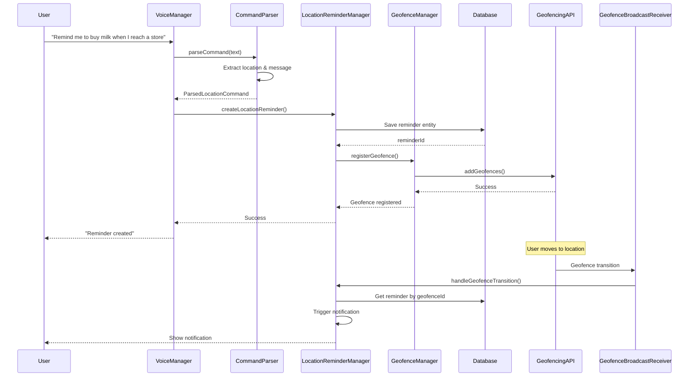

# Design Document: Location-Based Reminders

## Overview

This design document outlines the architecture and implementation approach for adding location-based reminder functionality to the Voice Reminder Assistant application. The system will leverage Android's Geofencing API and Location Services to monitor user location in the background and trigger reminders when users arrive at specified locations.

The feature extends the existing reminder system by adding a new reminder type (location-based) alongside the current time-based reminders. Users can create location-based reminders through voice commands, and the system will automatically detect when they enter the proximity of reminder locations.

### Key Design Principles

1. **Battery Efficiency**: Use Android's Geofencing API to minimize battery drain during location monitoring
2. **Privacy-First**: Request location permissions only when needed and provide clear explanations
3. **Extensibility**: Design the system to support both generic location types (e.g., "any store") and specific named locations (e.g., "home")
4. **Reliability**: Handle edge cases like device restarts, location service unavailability, and permission changes
5. **Integration**: Seamlessly integrate with the existing reminder architecture

## Architecture

### High-Level Architecture

```
┌─────────────────────────────────────────────────────────────┐
│                      Presentation Layer                      │
│  ┌──────────────┐  ┌──────────────┐  ┌──────────────────┐  │
│  │  MainActivity │  │ VoiceManager │  │ LocationSettings │  │
│  │              │  │              │  │     Activity     │  │
│  └──────────────┘  └──────────────┘  └──────────────────┘  │
└─────────────────────────────────────────────────────────────┘
                            │
                            ▼
┌─────────────────────────────────────────────────────────────┐
│                       Domain Layer                           │
│  ┌──────────────────┐  ┌──────────────────────────────┐    │
│  │ CommandParser    │  │   ReminderManager            │    │
│  │ (Extended)       │  │   (Extended)                 │    │
│  └──────────────────┘  └──────────────────────────────┘    │
│                                                              │
│  ┌──────────────────┐  ┌──────────────────────────────┐    │
│  │ LocationReminder │  │   GeofenceManager            │    │
│  │ Manager          │  │                              │    │
│  └──────────────────┘  └──────────────────────────────┘    │
│                                                              │
│  ┌──────────────────┐  ┌──────────────────────────────┐    │
│  │ LocationService  │  │   PlaceResolver              │    │
│  │ Manager          │  │                              │    │
│  └──────────────────┘  └──────────────────────────────┘    │
└─────────────────────────────────────────────────────────────┘
                            │
                            ▼
┌─────────────────────────────────────────────────────────────┐
│                        Data Layer                            │
│  ┌──────────────────┐  ┌──────────────────────────────┐    │
│  │ ReminderEntity   │  │   SavedLocationEntity        │    │
│  │ (Extended)       │  │                              │    │
│  └──────────────────┘  └──────────────────────────────┘    │
│                                                              │
│  ┌──────────────────┐  ┌──────────────────────────────┐    │
│  │ ReminderDao      │  │   SavedLocationDao           │    │
│  │ (Extended)       │  │                              │    │
│  └──────────────────┘  └──────────────────────────────┘    │
└─────────────────────────────────────────────────────────────┘
                            │
                            ▼
┌─────────────────────────────────────────────────────────────┐
│                    Android System Layer                      │
│  ┌──────────────────┐  ┌──────────────────────────────┐    │
│  │ Geofencing API   │  │   Location Services          │    │
│  └──────────────────┘  └──────────────────────────────┘    │
│                                                              │
│  ┌──────────────────┐  ┌──────────────────────────────┐    │
│  │ GeofenceBroadcast│  │   Geocoder API               │    │
│  │ Receiver         │  │                              │    │
│  └──────────────────┘  └──────────────────────────────┘    │
└─────────────────────────────────────────────────────────────┘
```

### Component Interaction Flow



## Components and Interfaces

### 1. Extended Data Models

#### ReminderEntity (Extended)

```kotlin
@Entity(tableName = "reminders")
data class ReminderEntity(
    @PrimaryKey(autoGenerate = true)
    val id: Long = 0,
    val message: String,
    val scheduledTime: Long?, // Nullable for location-based reminders
    val status: ReminderStatus,
    val createdAt: Long,
    
    // New fields for location-based reminders
    val reminderType: ReminderType = ReminderType.TIME_BASED,
    val locationData: String? = null, // JSON string containing location info
    val geofenceId: String? = null // Unique ID for the geofence
)

enum class ReminderType {
    TIME_BASED,
    LOCATION_BASED
}
```

#### LocationData (Serializable)

```kotlin
@Serializable
data class LocationData(
    val locationType: LocationType,
    val latitude: Double? = null,
    val longitude: Double? = null,
    val radius: Float = 100f, // meters
    val placeName: String? = null,
    val placeCategory: PlaceCategory? = null
)

enum class LocationType {
    SPECIFIC_PLACE,  // Home, work, custom address
    GENERIC_CATEGORY // Any store, pharmacy, etc.
}

enum class PlaceCategory {
    STORE,
    GROCERY,
    PHARMACY,
    GAS_STATION,
    RESTAURANT,
    CUSTOM
}
```

#### SavedLocationEntity

```kotlin
@Entity(tableName = "saved_locations")
data class SavedLocationEntity(
    @PrimaryKey(autoGenerate = true)
    val id: Long = 0,
    val name: String, // "Home", "Work", etc.
    val latitude: Double,
    val longitude: Double,
    val radius: Float = 100f,
    val createdAt: Long
)
```

### 2. Command Parser Extension

#### ParsedLocationCommand

```kotlin
data class ParsedLocationCommand(
    val message: String,
    val locationType: LocationType,
    val placeName: String? = null,
    val placeCategory: PlaceCategory? = null,
    val latitude: Double? = null,
    val longitude: Double? = null
)
```

#### CommandParser Extension

Add location parsing capabilities to the existing CommandParser:

```kotlin
class CommandParser {
    companion object {
        // Location trigger patterns
        private val LOCATION_TRIGGER_PATTERN = Regex(
            """(?:when I (?:reach|get to|arrive at)|at the|near the?)""",
            RegexOption.IGNORE_CASE
        )
        
        // Generic place categories
        private val GENERIC_PLACE_PATTERN = Regex(
            """(?:a |any |the )?(store|shop|grocery|pharmacy|gas station|restaurant)""",
            RegexOption.IGNORE_CASE
        )
        
        // Specific named places
        private val NAMED_PLACE_PATTERN = Regex(
            """(?:when I (?:reach|get to|arrive at)) (home|work|office|gym)""",
            RegexOption.IGNORE_CASE
        )
    }
    
    fun parseLocationCommand(text: String): ParsedLocationCommand? {
        // Implementation to extract location-based reminder details
    }
    
    fun isLocationCommand(text: String): Boolean {
        return LOCATION_TRIGGER_PATTERN.find(text) != null
    }
}
```

### 3. Location Reminder Manager

Core business logic for location-based reminders:

```kotlin
class LocationReminderManager(
    private val database: ReminderDatabase,
    private val geofenceManager: GeofenceManager,
    private val placeResolver: PlaceResolver,
    private val context: Context
) {
    /**
     * Create a location-based reminder
     */
    suspend fun createLocationReminder(
        message: String,
        locationData: LocationData
    ): ReminderResult
    
    /**
     * Handle geofence transition events
     */
    suspend fun handleGeofenceTransition(
        geofenceId: String,
        transitionType: Int
    )
    
    /**
     * Get all active location-based reminders
     */
    suspend fun getActiveLocationReminders(): List<Reminder>
    
    /**
     * Delete a location-based reminder and remove its geofence
     */
    suspend fun deleteLocationReminder(reminderId: Long)
    
    /**
     * Resolve generic place categories to actual locations
     * (e.g., find nearby stores when user is near any store)
     */
    suspend fun resolveGenericLocation(
        category: PlaceCategory,
        userLocation: Location
    ): List<Place>
}
```

### 4. Geofence Manager

Manages Android Geofencing API interactions:

```kotlin
class GeofenceManager(private val context: Context) {
    private val geofencingClient: GeofencingClient = 
        LocationServices.getGeofencingClient(context)
    
    /**
     * Register a geofence for a specific location
     */
    suspend fun registerGeofence(
        geofenceId: String,
        latitude: Double,
        longitude: Double,
        radius: Float
    ): Boolean
    
    /**
     * Register multiple geofences for generic categories
     * (e.g., all nearby stores)
     */
    suspend fun registerMultipleGeofences(
        geofences: List<GeofenceData>
    ): Boolean
    
    /**
     * Remove a geofence
     */
    suspend fun removeGeofence(geofenceId: String): Boolean
    
    /**
     * Remove all geofences
     */
    suspend fun removeAllGeofences(): Boolean
    
    /**
     * Get pending geofence intent for broadcast receiver
     */
    private fun getGeofencePendingIntent(): PendingIntent
}

data class GeofenceData(
    val id: String,
    val latitude: Double,
    val longitude: Double,
    val radius: Float
)
```

### 5. Location Service Manager

Manages location permissions and services:

```kotlin
class LocationServiceManager(private val context: Context) {
    /**
     * Check if location permissions are granted
     */
    fun hasLocationPermission(): Boolean
    
    /**
     * Check if background location permission is granted (Android 10+)
     */
    fun hasBackgroundLocationPermission(): Boolean
    
    /**
     * Check if location services are enabled
     */
    fun isLocationEnabled(): Boolean
    
    /**
     * Get current device location
     */
    suspend fun getCurrentLocation(): Location?
    
    /**
     * Request location permissions
     */
    fun requestLocationPermissions(activity: Activity)
    
    /**
     * Request background location permission
     */
    fun requestBackgroundLocationPermission(activity: Activity)
}
```

### 6. Place Resolver

Resolves place names and categories to geographic coordinates:

```kotlin
class PlaceResolver(private val context: Context) {
    private val geocoder: Geocoder = Geocoder(context, Locale.getDefault())
    
    /**
     * Resolve a place name or address to coordinates
     */
    suspend fun resolvePlace(placeName: String): PlaceResult?
    
    /**
     * Find nearby places of a specific category
     * Uses Google Places API or similar
     */
    suspend fun findNearbyPlaces(
        category: PlaceCategory,
        location: Location,
        radiusMeters: Int = 5000
    ): List<Place>
    
    /**
     * Get saved location by name
     */
    suspend fun getSavedLocation(name: String): SavedLocationEntity?
}

data class PlaceResult(
    val name: String,
    val latitude: Double,
    val longitude: Double,
    val address: String?
)

data class Place(
    val name: String,
    val latitude: Double,
    val longitude: Double,
    val category: PlaceCategory
)
```

### 7. Geofence Broadcast Receiver

Receives geofence transition events:

```kotlin
class GeofenceBroadcastReceiver : BroadcastReceiver() {
    override fun onReceive(context: Context, intent: Intent) {
        val geofencingEvent = GeofencingEvent.fromIntent(intent)
        
        if (geofencingEvent?.hasError() == true) {
            Log.e(TAG, "Geofence error: ${geofencingEvent.errorCode}")
            return
        }
        
        val transition = geofencingEvent?.geofenceTransition
        if (transition == Geofence.GEOFENCE_TRANSITION_ENTER) {
            val triggeringGeofences = geofencingEvent.triggeringGeofences
            // Handle geofence entry
            handleGeofenceEntry(context, triggeringGeofences)
        }
    }
    
    private fun handleGeofenceEntry(
        context: Context,
        geofences: List<Geofence>?
    ) {
        // Trigger reminders for entered geofences
    }
}
```

### 8. Location Settings Activity

UI for managing saved locations:

```kotlin
class LocationSettingsActivity : AppCompatActivity() {
    private lateinit var viewModel: LocationSettingsViewModel
    
    // Display list of saved locations
    // Allow adding new locations (current position, map, address)
    // Allow editing/deleting locations
    // Show location permissions status
}
```

## Data Models

### Database Schema

#### Reminders Table (Extended)

```sql
CREATE TABLE reminders (
    id INTEGER PRIMARY KEY AUTOINCREMENT,
    message TEXT NOT NULL,
    scheduled_time INTEGER, -- Nullable for location reminders
    status TEXT NOT NULL,
    created_at INTEGER NOT NULL,
    reminder_type TEXT NOT NULL DEFAULT 'TIME_BASED',
    location_data TEXT, -- JSON string
    geofence_id TEXT
);
```

#### Saved Locations Table

```sql
CREATE TABLE saved_locations (
    id INTEGER PRIMARY KEY AUTOINCREMENT,
    name TEXT NOT NULL UNIQUE,
    latitude REAL NOT NULL,
    longitude REAL NOT NULL,
    radius REAL NOT NULL DEFAULT 100.0,
    created_at INTEGER NOT NULL
);
```

### Shared Preferences

Store location-related settings:

```kotlin
object LocationPreferences {
    const val PREF_NAME = "location_prefs"
    const val KEY_LOCATION_PERMISSION_REQUESTED = "location_permission_requested"
    const val KEY_BACKGROUND_PERMISSION_REQUESTED = "background_permission_requested"
    const val KEY_DEFAULT_RADIUS = "default_radius"
    const val KEY_GENERIC_PLACE_RADIUS = "generic_place_radius"
}
```

## Error Handling

### Location Permission Errors

1. **Permission Denied**: Show explanation dialog and guide user to settings
2. **Background Permission Denied**: Explain limitation and offer foreground-only mode
3. **Permission Revoked**: Detect permission changes and disable location reminders

### Location Service Errors

1. **Location Services Disabled**: Show dialog prompting user to enable location
2. **Location Unavailable**: Retry with exponential backoff, show user notification
3. **Geocoding Failure**: Fall back to manual coordinate entry or map selection

### Geofencing Errors

1. **Geofence Limit Exceeded**: Android limits to 100 geofences per app - prioritize active reminders
2. **Geofence Registration Failed**: Retry up to 3 times, then notify user
3. **Geofence Removed by System**: Re-register geofences on next app launch

### Edge Cases

1. **User Already at Location**: Trigger reminder immediately upon creation
2. **Duplicate Triggers**: Implement 30-minute cooldown to prevent repeated notifications
3. **Device Restart**: Re-register all active geofences in BootReceiver
4. **App Force-Stopped**: Geofences are removed - re-register on next app launch

## Testing Strategy

### Unit Tests

1. **CommandParser Tests**
   - Test location command parsing for various formats
   - Test extraction of place names and categories
   - Test edge cases (ambiguous commands, missing information)

2. **LocationReminderManager Tests**
   - Test reminder creation with different location types
   - Test geofence transition handling
   - Test reminder triggering logic

3. **PlaceResolver Tests**
   - Test geocoding with mock Geocoder
   - Test saved location retrieval
   - Test nearby place search

### Integration Tests

1. **Geofence Registration**
   - Test geofence registration with GeofencingClient
   - Test geofence removal
   - Test multiple geofence management

2. **Database Operations**
   - Test saving location-based reminders
   - Test querying active location reminders
   - Test saved location CRUD operations

3. **Permission Handling**
   - Test permission request flows
   - Test behavior with different permission states

### Manual Testing

1. **Real-World Scenarios**
   - Create reminder for home, drive away, return home
   - Create reminder for "any store", visit different stores
   - Test with location services disabled
   - Test with permissions denied

2. **Battery Impact**
   - Monitor battery usage over 24 hours with active location reminders
   - Compare with time-based reminders only

3. **Notification Reliability**
   - Test notification delivery in various app states (foreground, background, killed)
   - Test notification content and actions

## Implementation Phases

### Phase 1: Core Infrastructure
- Extend data models (ReminderEntity, LocationData)
- Create SavedLocationEntity and DAO
- Implement LocationServiceManager
- Add location permissions to manifest

### Phase 2: Command Parsing
- Extend CommandParser for location commands
- Implement location keyword detection
- Add support for generic and specific locations

### Phase 3: Geofencing
- Implement GeofenceManager
- Create GeofenceBroadcastReceiver
- Integrate with LocationReminderManager

### Phase 4: Place Resolution
- Implement PlaceResolver with Geocoder
- Add saved location management
- Implement nearby place search (optional: Google Places API)

### Phase 5: UI Integration
- Add location reminder creation flow
- Create LocationSettingsActivity
- Update reminder list to show location reminders
- Add location permission request dialogs

### Phase 6: Edge Cases & Polish
- Implement duplicate trigger prevention
- Add geofence re-registration on boot
- Handle location service errors gracefully
- Optimize battery usage

## Dependencies

### Required Android APIs
- **Google Play Services Location**: `com.google.android.gms:play-services-location:21.0.1`
- **Kotlinx Serialization**: `org.jetbrains.kotlinx:kotlinx-serialization-json:1.5.1`

### Permissions Required
```xml
<!-- Fine location for accurate geofencing -->
<uses-permission android:name="android.permission.ACCESS_FINE_LOCATION" />

<!-- Coarse location as fallback -->
<uses-permission android:name="android.permission.ACCESS_COARSE_LOCATION" />

<!-- Background location for geofencing (Android 10+) -->
<uses-permission android:name="android.permission.ACCESS_BACKGROUND_LOCATION" />
```

### Minimum SDK Requirements
- Minimum SDK: 24 (Android 7.0) - for geofencing reliability
- Target SDK: 34 (Android 14)

## Performance Considerations

### Battery Optimization
1. Use Geofencing API instead of continuous location updates
2. Set appropriate geofence radius (100-200m) to balance accuracy and battery
3. Limit number of active geofences (prioritize nearest or most recent)
4. Stop location monitoring when no active location reminders exist

### Memory Optimization
1. Use lazy initialization for location services
2. Cache geocoding results to avoid repeated API calls
3. Limit saved locations to reasonable number (e.g., 20)

### Network Optimization
1. Cache nearby place search results
2. Use coarse location when fine location not necessary
3. Implement offline mode for saved locations

## Security & Privacy

1. **Permission Transparency**: Clearly explain why location access is needed
2. **Data Minimization**: Only store necessary location data
3. **User Control**: Allow users to view and delete location data
4. **No Tracking**: Location data used only for reminder triggering, not tracking
5. **Secure Storage**: Encrypt sensitive location data in database

## Future Enhancements

1. **Smart Suggestions**: Learn frequently visited places and suggest them
2. **Route-Based Reminders**: "Remind me on my way home"
3. **Time + Location**: "Remind me to buy milk at the store after 5 PM"
4. **Geofence Sharing**: Share location reminders with family members
5. **Location History**: Show map of where reminders were triggered
6. **Integration with Maps**: Show reminders on Google Maps
