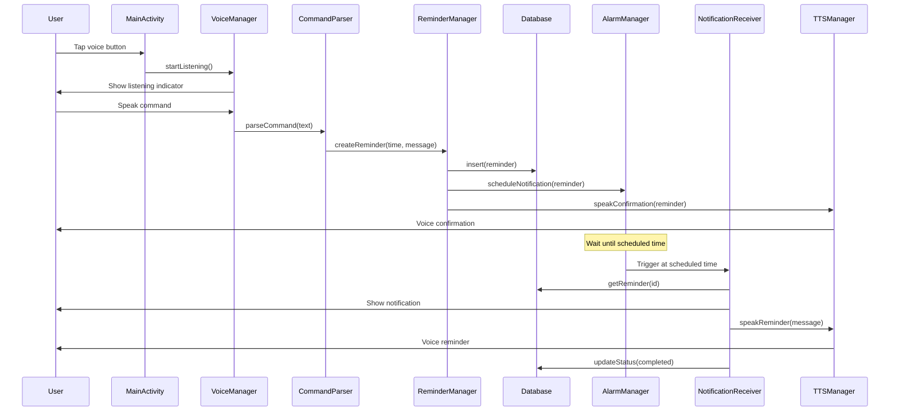

# Design Document: Voice Reminder Assistant

## Overview

The Voice Reminder Assistant is a minimal viable Android application built with Kotlin that enables users to create time-based reminders through voice commands. The application leverages Android's built-in Speech-to-Text (STT) and Text-to-Speech (TTS) engines, stores data locally using Room database, and delivers notifications with voice output at scheduled times.

The design follows modern Android architecture patterns with a clear separation of concerns across presentation, domain, and data layers. The application prioritizes simplicity and core functionality for the MVP release.

## Architecture

### High-Level Architecture

```
┌─────────────────────────────────────────────────────────────┐
│                     Presentation Layer                       │
│  ┌──────────────┐  ┌──────────────┐  ┌──────────────┐      │
│  │  MainActivity │  │ VoiceManager │  │ TTSManager   │      │
│  └──────────────┘  └──────────────┘  └──────────────┘      │
└─────────────────────────────────────────────────────────────┘
                            │
┌─────────────────────────────────────────────────────────────┐
│                      Domain Layer                            │
│  ┌──────────────┐  ┌──────────────┐  ┌──────────────┐      │
│  │CommandParser │  │ReminderManager│ │NotificationMgr│      │
│  └──────────────┘  └──────────────┘  └──────────────┘      │
└─────────────────────────────────────────────────────────────┘
                            │
┌─────────────────────────────────────────────────────────────┐
│                       Data Layer                             │
│  ┌──────────────┐  ┌──────────────┐  ┌──────────────┐      │
│  │ReminderEntity│  │ ReminderDao  │  │ReminderDatabase│     │
│  └──────────────┘  └──────────────┘  └──────────────┘      │
└─────────────────────────────────────────────────────────────┐
```

### Application Flow



## Components and Interfaces

### 1. Presentation Layer

#### MainActivity
Primary activity that hosts the user interface and coordinates voice interactions.

**Responsibilities:**
- Display voice input button and status indicators
- Request runtime permissions (RECORD_AUDIO, POST_NOTIFICATIONS)
- Initialize VoiceManager and TTSManager
- Handle activity lifecycle events

**Key Methods:**
```kotlin
class MainActivity : AppCompatActivity() {
    fun onVoiceButtonClick()
    fun onSpeechResult(text: String)
    fun showListeningIndicator()
    fun hideListeningIndicator()
    fun displayError(message: String)
}
```

#### VoiceManager
Manages Speech-to-Text functionality using Android's SpeechRecognizer.

**Responsibilities:**
- Initialize and configure SpeechRecognizer
- Handle speech recognition lifecycle
- Provide callbacks for recognition results and errors

**Key Methods:**
```kotlin
class VoiceManager(context: Context) {
    fun startListening()
    fun stopListening()
    fun isAvailable(): Boolean
    interface VoiceCallback {
        fun onResult(text: String)
        fun onError(error: String)
    }
}
```

#### TTSManager
Manages Text-to-Speech functionality using Android's TextToSpeech engine.

**Responsibilities:**
- Initialize TTS engine
- Queue and speak text messages
- Handle TTS lifecycle and cleanup

**Key Methods:**
```kotlin
class TTSManager(context: Context) {
    fun speak(text: String)
    fun stop()
    fun isReady(): Boolean
    fun shutdown()
}
```

### 2. Domain Layer

#### CommandParser
Parses voice command text to extract reminder time and message.

**Responsibilities:**
- Parse natural language time expressions
- Extract reminder message content
- Validate parsed data

**Key Methods:**
```kotlin
class CommandParser {
    fun parseCommand(text: String): ParsedCommand?
    private fun extractTime(text: String): LocalDateTime?
    private fun extractMessage(text: String): String?
}

data class ParsedCommand(
    val scheduledTime: LocalDateTime,
    val message: String
)
```

**Parsing Strategy:**
- Support patterns: "remind me at [TIME] to [MESSAGE]"
- Handle time formats: "2 PM", "14:00", "in 30 minutes"
- Use regex patterns for time extraction
- Default to simple pattern matching for MVP

#### ReminderManager
Core business logic for managing reminders.

**Responsibilities:**
- Create and store reminders
- Schedule notifications via AlarmManager
- Retrieve and update reminder status
- Coordinate between database and notification scheduling

**Key Methods:**
```kotlin
class ReminderManager(
    private val database: ReminderDatabase,
    private val context: Context
) {
    suspend fun createReminder(time: LocalDateTime, message: String): Long
    suspend fun getActiveReminders(): List<Reminder>
    suspend fun markAsCompleted(reminderId: Long)
    suspend fun deleteReminder(reminderId: Long)
    fun scheduleNotification(reminder: Reminder)
}
```

#### NotificationScheduler
Handles scheduling and canceling of reminder notifications.

**Responsibilities:**
- Schedule exact alarms using AlarmManager
- Handle Android 12+ exact alarm permissions
- Cancel scheduled alarms
- Reschedule reminders after device boot

**Key Methods:**
```kotlin
class NotificationScheduler(private val context: Context) {
    fun scheduleReminder(reminder: Reminder)
    fun cancelReminder(reminderId: Long)
    fun rescheduleAllReminders(reminders: List<Reminder>)
}
```

### 3. Data Layer

#### ReminderEntity
Room entity representing a reminder in the database.

```kotlin
@Entity(tableName = "reminders")
data class ReminderEntity(
    @PrimaryKey(autoGenerate = true)
    val id: Long = 0,
    val message: String,
    val scheduledTime: Long, // Unix timestamp
    val status: ReminderStatus,
    val createdAt: Long
)

enum class ReminderStatus {
    PENDING,
    COMPLETED,
    CANCELLED
}
```

#### ReminderDao
Data Access Object for reminder database operations.

```kotlin
@Dao
interface ReminderDao {
    @Insert
    suspend fun insert(reminder: ReminderEntity): Long
    
    @Query("SELECT * FROM reminders WHERE status = 'PENDING' ORDER BY scheduledTime ASC")
    suspend fun getActiveReminders(): List<ReminderEntity>
    
    @Query("SELECT * FROM reminders WHERE id = :id")
    suspend fun getReminderById(id: Long): ReminderEntity?
    
    @Update
    suspend fun update(reminder: ReminderEntity)
    
    @Delete
    suspend fun delete(reminder: ReminderEntity)
}
```

#### ReminderDatabase
Room database singleton.

```kotlin
@Database(entities = [ReminderEntity::class], version = 1)
abstract class ReminderDatabase : RoomDatabase() {
    abstract fun reminderDao(): ReminderDao
    
    companion object {
        @Volatile
        private var INSTANCE: ReminderDatabase? = null
        
        fun getDatabase(context: Context): ReminderDatabase {
            return INSTANCE ?: synchronized(this) {
                val instance = Room.databaseBuilder(
                    context.applicationContext,
                    ReminderDatabase::class.java,
                    "reminder_database"
                ).build()
                INSTANCE = instance
                instance
            }
        }
    }
}
```

### 4. Background Components

#### ReminderReceiver
BroadcastReceiver that handles scheduled reminder notifications.

**Responsibilities:**
- Receive alarm broadcasts from AlarmManager
- Display notification
- Trigger TTS for voice output
- Update reminder status in database

```kotlin
class ReminderReceiver : BroadcastReceiver() {
    override fun onReceive(context: Context, intent: Intent) {
        // Extract reminder ID from intent
        // Fetch reminder from database
        // Show notification
        // Trigger TTS
        // Update status
    }
}
```

#### BootReceiver
BroadcastReceiver that reschedules reminders after device boot.

**Responsibilities:**
- Listen for BOOT_COMPLETED broadcast
- Retrieve active reminders from database
- Reschedule all pending reminders

```kotlin
class BootReceiver : BroadcastReceiver() {
    override fun onReceive(context: Context, intent: Intent) {
        if (intent.action == Intent.ACTION_BOOT_COMPLETED) {
            // Reschedule all active reminders
        }
    }
}
```

## Data Models

### Domain Model

```kotlin
data class Reminder(
    val id: Long,
    val message: String,
    val scheduledTime: LocalDateTime,
    val status: ReminderStatus,
    val createdAt: LocalDateTime
)
```

### Mapping Functions

```kotlin
fun ReminderEntity.toDomain(): Reminder {
    return Reminder(
        id = id,
        message = message,
        scheduledTime = LocalDateTime.ofEpochSecond(scheduledTime, 0, ZoneOffset.UTC),
        status = status,
        createdAt = LocalDateTime.ofEpochSecond(createdAt, 0, ZoneOffset.UTC)
    )
}

fun Reminder.toEntity(): ReminderEntity {
    return ReminderEntity(
        id = id,
        message = message,
        scheduledTime = scheduledTime.toEpochSecond(ZoneOffset.UTC),
        status = status,
        createdAt = createdAt.toEpochSecond(ZoneOffset.UTC)
    )
}
```

## Error Handling

### Voice Recognition Errors

**Scenarios:**
- STT service unavailable
- No speech detected
- Network error (if using cloud STT)
- Permission denied

**Handling:**
- Display user-friendly error messages
- Provide retry option
- Fall back to text input if STT repeatedly fails
- Log errors for debugging

### TTS Errors

**Scenarios:**
- TTS engine not initialized
- Language data not available
- Audio focus issues

**Handling:**
- Gracefully degrade to text-only notifications
- Show visual confirmation instead of voice
- Initialize TTS asynchronously to avoid blocking

### Database Errors

**Scenarios:**
- Database corruption
- Disk space full
- Concurrent access issues

**Handling:**
- Use try-catch blocks around database operations
- Provide user feedback on save failures
- Implement database migration strategy for future versions

### Notification Scheduling Errors

**Scenarios:**
- Exact alarm permission denied (Android 12+)
- Invalid time (past time)
- AlarmManager restrictions

**Handling:**
- Request SCHEDULE_EXACT_ALARM permission
- Validate time before scheduling
- Use inexact alarms as fallback
- Inform user of scheduling limitations

## Testing Strategy

### Unit Tests

**CommandParser Tests:**
- Test various time format parsing
- Test message extraction
- Test invalid input handling
- Test edge cases (midnight, next day)

**ReminderManager Tests:**
- Test reminder creation logic
- Test status updates
- Mock database and AlarmManager
- Verify correct scheduling calls

### Integration Tests

**Database Tests:**
- Test CRUD operations
- Test query correctness
- Test data persistence
- Use in-memory database for testing

**End-to-End Flow Tests:**
- Test complete reminder creation flow
- Test notification delivery
- Test boot receiver functionality
- Use Android Instrumentation tests

### Manual Testing Checklist

- Voice input captures correctly
- Reminders save to database
- Notifications trigger at correct time
- TTS speaks reminders
- App survives device restart
- Permissions handled correctly
- Error messages display appropriately

## Android Permissions

Required permissions in AndroidManifest.xml:

```xml
<!-- Voice input -->
<uses-permission android:name="android.permission.RECORD_AUDIO" />

<!-- Notifications -->
<uses-permission android:name="android.permission.POST_NOTIFICATIONS" />

<!-- Exact alarms (Android 12+) -->
<uses-permission android:name="android.permission.SCHEDULE_EXACT_ALARM" />

<!-- Boot receiver -->
<uses-permission android:name="android.permission.RECEIVE_BOOT_COMPLETED" />

<!-- Foreground service for TTS during notification -->
<uses-permission android:name="android.permission.FOREGROUND_SERVICE" />
```

## Dependencies

### Gradle Dependencies

```kotlin
dependencies {
    // Core Android
    implementation("androidx.core:core-ktx:1.12.0")
    implementation("androidx.appcompat:appcompat:1.6.1")
    implementation("com.google.android.material:material:1.11.0")
    
    // Room Database
    implementation("androidx.room:room-runtime:2.6.1")
    implementation("androidx.room:room-ktx:2.6.1")
    kapt("androidx.room:room-compiler:2.6.1")
    
    // Coroutines
    implementation("org.jetbrains.kotlinx:kotlinx-coroutines-android:1.7.3")
    
    // Lifecycle
    implementation("androidx.lifecycle:lifecycle-runtime-ktx:2.7.0")
    
    // Testing
    testImplementation("junit:junit:4.13.2")
    androidTestImplementation("androidx.test.ext:junit:1.1.5")
    androidTestImplementation("androidx.room:room-testing:2.6.1")
}
```

## Project Structure

```
app/
├── src/
│   ├── main/
│   │   ├── java/com/example/voicereminder/
│   │   │   ├── data/
│   │   │   │   ├── ReminderEntity.kt
│   │   │   │   ├── ReminderDao.kt
│   │   │   │   └── ReminderDatabase.kt
│   │   │   ├── domain/
│   │   │   │   ├── CommandParser.kt
│   │   │   │   ├── ReminderManager.kt
│   │   │   │   ├── NotificationScheduler.kt
│   │   │   │   └── models/
│   │   │   │       └── Reminder.kt
│   │   │   ├── presentation/
│   │   │   │   ├── MainActivity.kt
│   │   │   │   ├── VoiceManager.kt
│   │   │   │   └── TTSManager.kt
│   │   │   ├── receivers/
│   │   │   │   ├── ReminderReceiver.kt
│   │   │   │   └── BootReceiver.kt
│   │   │   └── VoiceReminderApplication.kt
│   │   ├── res/
│   │   │   ├── layout/
│   │   │   │   └── activity_main.xml
│   │   │   ├── values/
│   │   │   │   ├── strings.xml
│   │   │   │   └── colors.xml
│   │   │   └── drawable/
│   │   └── AndroidManifest.xml
│   └── test/
│       └── java/com/example/voicereminder/
│           ├── CommandParserTest.kt
│           └── ReminderManagerTest.kt
└── build.gradle.kts
```

## Performance Considerations

### Memory Management
- Use lifecycle-aware components to prevent leaks
- Release TTS resources in onDestroy()
- Cancel coroutines when activity is destroyed
- Use weak references for callbacks where appropriate

### Battery Optimization
- Use exact alarms only when necessary
- Minimize wake locks
- Batch database operations
- Avoid continuous background services

### Startup Performance
- Initialize TTS asynchronously
- Lazy-load database instance
- Defer non-critical initialization
- Use splash screen if needed

## Security Considerations

### Data Privacy
- All data stored locally (no cloud sync in MVP)
- No sensitive data encryption required for MVP
- Clear data on app uninstall

### Permissions
- Request permissions at runtime with clear rationale
- Handle permission denial gracefully
- Minimal permission scope

## Future Enhancements (Post-MVP)

- Recurring reminders
- Location-based reminders
- Reminder editing and listing UI
- Natural language processing improvements
- Cloud backup and sync
- Widget support
- Wear OS companion app
- Multiple language support
