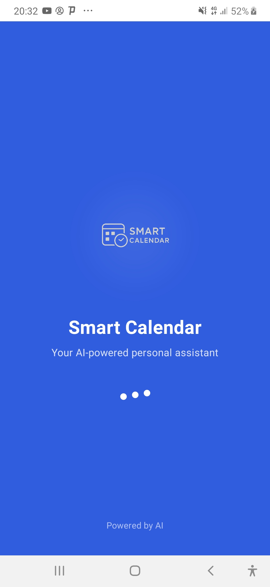
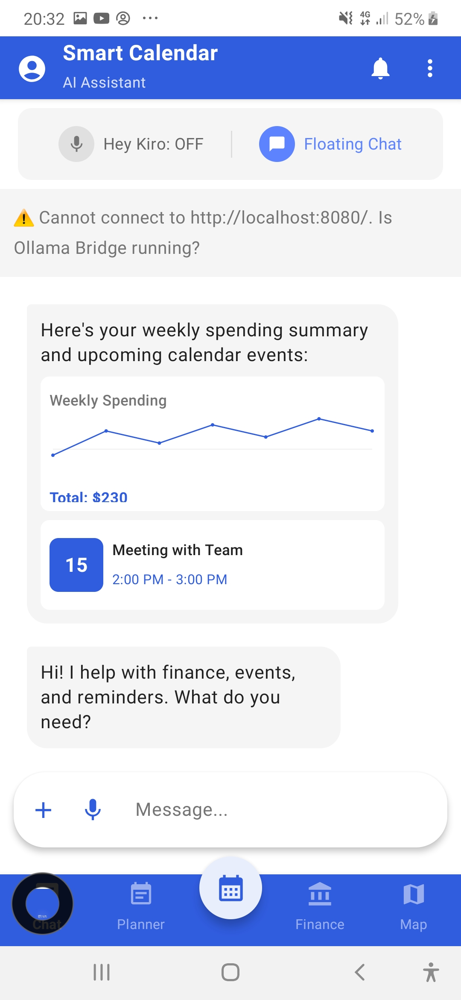
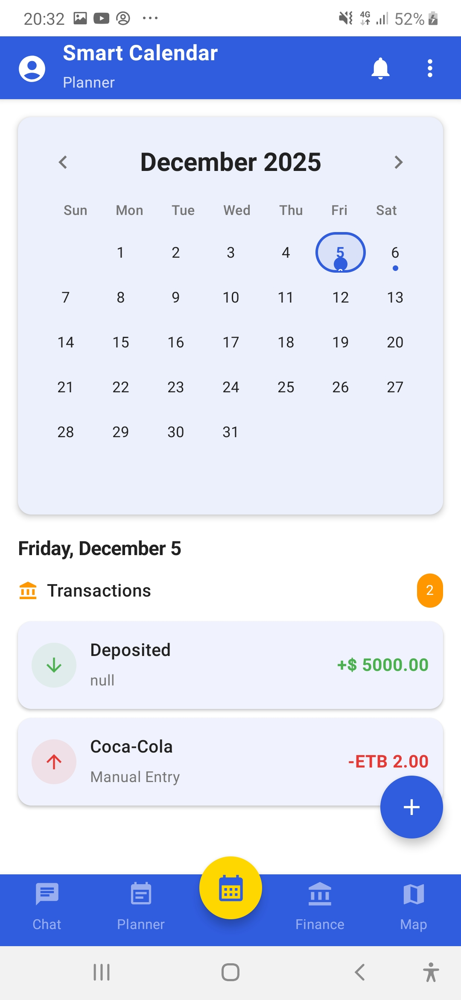
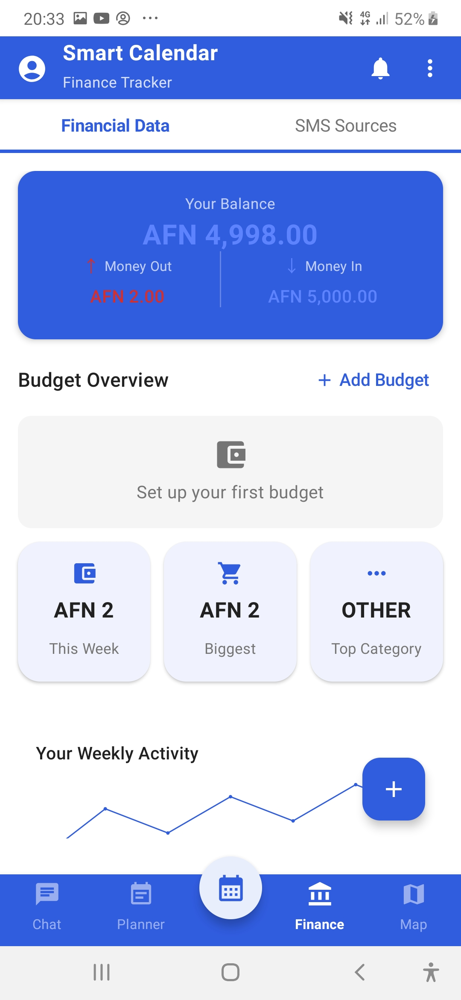
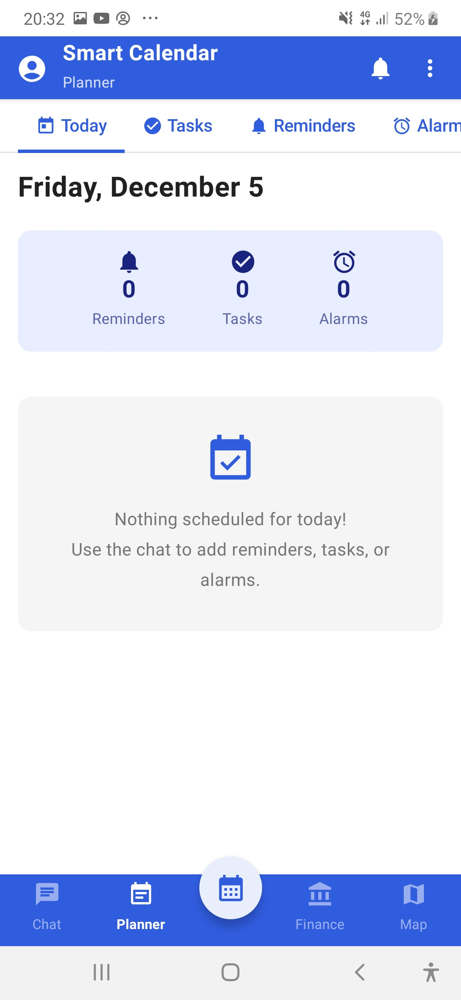
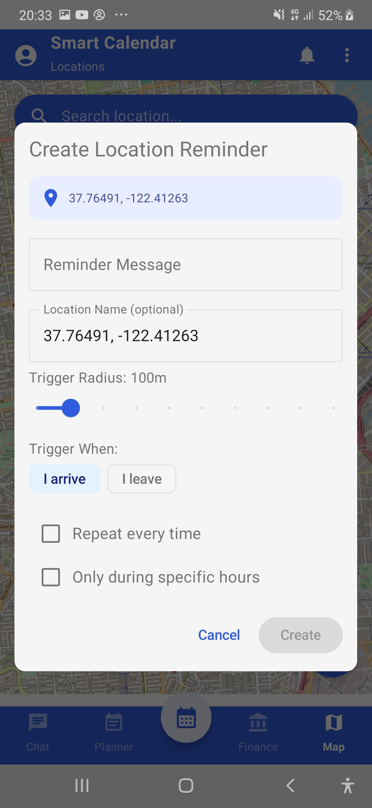

<p align="center">
  
</p>

<h1 align="center">Smart Calendar</h1>

<p align="center">
  <strong>AI-Powered Android Personal Assistant</strong><br>
  Voice commands • Finance tracking • Location reminders • Smart scheduling
</p>

<p align="center">
  
  
  
  
</p>

<p align="center">
  🎃 <em>Kiroween Hackathon Entry — Frankenstein Category</em>
</p>

---

## 📋 Table of Contents

- [Download APK](#-download-apk)
- [Features](#-features)
- [Screenshots](#-screenshots)
- [Requirements](#-requirements)
- [Installation](#-installation)
- [Configuration](#-configuration)
- [Usage Guide](#-usage-guide)
- [Voice Commands](#-voice-commands)
- [Project Structure](#-project-structure)
- [Tech Stack](#-tech-stack)
- [Kiro Specs](#-kiro-specs)
- [Contributing](#-contributing)
- [License](#-license)

---

## 📥 Download APK

<p align="center">
  <a href="https://github.com/GPT-Calendar/smart-calendar/releases/tag/v0.0.1/smart-calendar.apk">
    
  </a>
</p>

**[⬇️ Download Smart Calendar v0.0.1 Beta](https://github.com/GPT-Calendar/smart-calendar/releases/tag/v0.0.1/smart-calendar.apk)**

### How to Install

1. Download the APK
2. Disable Play Protect (required for APK installation)
3. Install the APK

### Disable Play Protect

1. Open **Google Play Store**
2. Tap your **profile icon** (top right)
3. Tap **Play Protect**
4. Tap **Settings** (gear icon)
5. Turn OFF **Scan apps with Play Protect**
6. Confirm by tapping **Turn off**

Now install the APK — you can re-enable Play Protect after installation.

### After Installation

1. Open the app
2. Grant requested permissions (microphone, notifications, etc.)
3. Configure your AI provider in Settings (Ollama or OpenAI)

---

## ✨ Features

### 🎤 Voice-First Interface
Talk naturally to your assistant:
- *"Remind me to call John at 3 PM tomorrow"*
- *"I spent 500 birr on groceries today"*
- *"Set an alarm for 7 AM every weekday"*
- *"Remind me to buy milk when I reach the store"*

### 🔊 "Kiro" Wake Word
Say **"Kiro"** followed by your command — even with your phone in your pocket. Custom implementation using Android's AudioRecord API with support for variants: Kiro, Kyro, Kero, Cairo, Kira.

### 📍 Location-Based Reminders
Geofencing-powered reminders that trigger when you arrive or leave locations:
- Named places (home, work, gym)
- Generic categories (any store, pharmacy)
- Custom radius and time constraints

### 💰 Finance Tracking
- AI-powered SMS parsing for automatic transaction detection
- Manual entry with categorization
- Budget management with 80% warnings
- Spending insights and analytics

### ✅ Tasks & Alarms
- Priority levels with color coding
- Categories: Work, Personal, Shopping, Health
- Recurring schedules (daily, weekly, monthly)
- Snooze options and rich notifications

### 📱 Home Screen Widgets
- **Voice Button (2x2)** — One-tap voice input
- **Next Up (3x1)** — Upcoming reminder display
- **Chat Widget (4x3)** — Full chat interface

### 💬 Floating Chat Bubble
Persistent overlay for quick access from any app.

---

## 📸 Screenshots

| Launch Screen | AI Assistant | Calendar |
|:-------------:|:------------:|:--------:|
|  |  |  |

| Finance | Planner | Location Reminder |
|:-------:|:-------:|:-----------------:|
|  |  |  |

---

## 📦 Requirements

### Development Tools

| Tool | Version | Download |
|------|---------|----------|
| **Android Studio** | Hedgehog (2023.1.1) or later | [Download](https://developer.android.com/studio) |
| **JDK** | 17 or later | [Download](https://adoptium.net/) |
| **Git** | Latest | [Download](https://git-scm.com/) |

### SDK Requirements

| Requirement | Version |
|-------------|---------|
| **Minimum SDK** | 26 (Android 8.0 Oreo) |
| **Target SDK** | 34 (Android 14) |
| **Compile SDK** | 34 |
| **Kotlin** | 1.9.20 |
| **Gradle** | 8.2 |

### AI Backend (Choose One)

#### Option A: Ollama (Local/Free)
- Install [Ollama](https://ollama.ai/)
- Pull a model: `ollama pull llama3.2` or `ollama pull mistral`
- Run: `ollama serve`
- Default endpoint: `http://localhost:11434`

#### Option B: OpenAI API
- Get API key from [OpenAI Platform](https://platform.openai.com/)
- Configure in app settings

---

## 🚀 Installation

### Step 1: Clone the Repository

```bash
git clone https://github.com/yourusername/smart-calendar.git
cd smart-calendar
```

### Step 2: Open in Android Studio

1. Launch Android Studio
2. Select **File → Open**
3. Navigate to the cloned `smart-calendar` folder
4. Click **OK** and wait for Gradle sync to complete

### Step 3: Configure SDK (if needed)

If you see SDK errors:
1. Go to **File → Project Structure → SDK Location**
2. Set Android SDK path (usually `~/Android/Sdk` on Linux/Mac or `C:\Users\<user>\AppData\Local\Android\Sdk` on Windows)

### Step 4: Build the Project

**Via Android Studio:**
- Click **Build → Make Project** or press `Ctrl+F9` / `Cmd+F9`

**Via Command Line:**

```bash
# Windows
gradlew.bat build

# macOS/Linux
./gradlew build
```

### Step 5: Run on Device/Emulator

**Physical Device:**
1. Enable **Developer Options** on your Android device
2. Enable **USB Debugging**
3. Connect via USB
4. Select your device in Android Studio
5. Click **Run** (green play button) or press `Shift+F10`

**Emulator:**
1. Open **Device Manager** in Android Studio
2. Create a new virtual device (API 26+)
3. Select the emulator and click **Run**

**Via Command Line:**

```bash
# Install debug APK
gradlew.bat installDebug   # Windows
./gradlew installDebug     # macOS/Linux
```

---

## ⚙️ Configuration

### AI Provider Setup

After installing the app, configure your AI provider:

1. Open the app
2. Go to **Settings** (gear icon)
3. Select **AI Provider**
4. Choose **Ollama** or **OpenAI**

#### Ollama Configuration
```
Endpoint: http://10.0.2.2:11434  (for emulator)
          http://<your-ip>:11434 (for physical device)
Model: llama3.2, mistral, or any installed model
```

#### OpenAI Configuration
```
API Key: sk-your-api-key-here
Model: gpt-4o-mini (recommended) or gpt-4o
```

### Permissions

Grant these permissions when prompted:

| Permission | Purpose | Required |
|------------|---------|----------|
| **Microphone** | Voice input & wake word detection | Yes |
| **Notifications** | Reminder alerts | Yes |
| **Location** | Geofencing reminders | For location features |
| **Background Location** | Geofencing when app closed | For location features |
| **SMS** | Auto-detect bank transactions | For finance features |
| **Display Over Apps** | Floating chat bubble | For bubble feature |
| **Exact Alarms** | Precise reminder timing | Yes |

---

## 📖 Usage Guide

### First Launch

1. **Grant Permissions** — Accept required permissions for full functionality
2. **Configure AI** — Set up Ollama or OpenAI in Settings
3. **Test Voice** — Tap the microphone and say "Remind me to test in 1 minute"

### Creating Reminders

**Voice:**
- Tap microphone → "Remind me to [task] at [time]"

**Text:**
- Type in chat → "Remind me to call mom tomorrow at 3 PM"

**Calendar:**
- Navigate to Calendar tab → Tap date → Add reminder

### Using Wake Word

1. Enable wake word in Settings
2. Say "Kiro" followed by your command
3. Example: "Kiro, remind me to take medicine at 8 PM"

### Adding Widgets

1. Long-press home screen
2. Select **Widgets**
3. Find **Smart Calendar** widgets
4. Drag to home screen

### Finance Tracking

**Automatic (SMS):**
- Grant SMS permission
- Bank transactions are auto-detected

**Manual:**
- Say "I spent 50 dollars on lunch"
- Or use Finance tab → Add Transaction

### Location Reminders

1. Grant location permissions
2. Say "Remind me to buy milk when I reach the store"
3. Or specify: "Remind me to check email when I get home"

---

## 🎙️ Voice Commands

### Time-Based Reminders

| Command | Example |
|---------|---------|
| At specific time | "Remind me to call mom at 3 PM" |
| In duration | "Remind me to check oven in 30 minutes" |
| On specific day | "Remind me to submit report on Friday at 10 AM" |
| Recurring | "Remind me to take medicine every day at 8 AM" |

### Location-Based Reminders

| Command | Example |
|---------|---------|
| When arriving | "Remind me to buy milk when I reach the store" |
| When leaving | "Remind me to text mom when I leave work" |
| At named place | "Remind me to workout when I get to the gym" |

### Tasks

| Command | Example |
|---------|---------|
| Add task | "Add task finish the report" |
| With priority | "Create task call client with high priority" |
| Complete task | "Mark buy groceries as done" |

### Alarms

| Command | Example |
|---------|---------|
| Simple alarm | "Set alarm for 7 AM" |
| Recurring | "Set alarm for 6:30 AM every weekday" |
| Named alarm | "Set alarm called morning workout for 5:30 AM" |

### Finance

| Command | Example |
|---------|---------|
| Expense | "I spent 500 birr on groceries" |
| Income | "I received 5000 birr salary" |
| Category | "I spent 200 on transportation today" |

---

## 🏗️ Project Structure

```
smart-calendar/
├── app/
│   ├── src/main/
│   │   ├── java/com/example/voicereminder/
│   │   │   ├── data/                    # Data layer
│   │   │   │   ├── ai/                  # AI service abstractions
│   │   │   │   ├── dao/                 # Room DAOs (8 tables)
│   │   │   │   ├── entity/              # Database entities
│   │   │   │   ├── repository/          # Repository implementations
│   │   │   │   └── settings/            # App preferences
│   │   │   ├── domain/                  # Business logic
│   │   │   │   ├── models/              # Domain models
│   │   │   │   └── *.kt                 # Managers & services
│   │   │   ├── presentation/            # UI layer (Jetpack Compose)
│   │   │   │   ├── alarms/              # Alarm screens
│   │   │   │   ├── calendar/            # Calendar screens
│   │   │   │   ├── chat/                # Chat interface
│   │   │   │   ├── components/          # Shared UI components
│   │   │   │   ├── finance/             # Finance screens
│   │   │   │   ├── map/                 # Map screen
│   │   │   │   ├── planner/             # Unified planner
│   │   │   │   ├── settings/            # Settings screens
│   │   │   │   ├── splash/              # Splash screen
│   │   │   │   ├── tasks/               # Task screens
│   │   │   │   └── ui/theme/            # Theme & colors
│   │   │   ├── receivers/               # Broadcast receivers
│   │   │   ├── sms/                     # SMS parsing
│   │   │   ├── widget/                  # Home screen widgets
│   │   │   └── VoiceReminderApplication.kt
│   │   ├── res/                         # Resources
│   │   └── AndroidManifest.xml
│   └── build.gradle.kts
├── .kiro/
│   └── specs/                           # Feature specifications
├── gradle/
├── build.gradle.kts                     # Root build config
├── settings.gradle.kts
└── README.md
```

---

## 🛠️ Tech Stack

| Category | Technology |
|----------|------------|
| **Language** | Kotlin 1.9.20 |
| **UI Framework** | Jetpack Compose |
| **Design System** | Material 3 |
| **Database** | Room (SQLite) |
| **AI Integration** | Ollama API, OpenAI API |
| **Maps** | OSMDroid (OpenStreetMap) |
| **Location** | Android Geofencing API |
| **Voice Input** | SpeechRecognizer |
| **Voice Output** | TextToSpeech |
| **Wake Word** | AudioRecord (custom) |
| **Async** | Kotlin Coroutines, Flow |
| **Background** | WorkManager, Foreground Services |
| **Widgets** | AppWidgetProvider |
| **Build** | Gradle (Kotlin DSL) |

---

## 📁 Kiro Specs

Feature specifications are in `.kiro/specs/`. Each feature has:
- `requirements.md` — What the feature should do
- `design.md` — Technical design decisions
- `tasks.md` — Implementation checklist

```
.kiro/specs/
├── multi-screen-ui/              # UI design system
├── chat-enhancements/            # Chat features
├── finance-enhancements/         # Finance system
├── reminder-task-alarm-enhancements/  # Task management
└── calendar-ui-enhancement/      # Calendar features
```

---

## 🎨 Design System

**Color Strategy (60-30-10):**
- 60% White (#FFFFFF) — Backgrounds
- 30% Deep Blue (#305CDE) — Branding, headers
- 10% Light Blue (#5D83FF) — Accents, CTAs

**Typography:** Roboto font family

**Accessibility:**
- 48dp minimum touch targets
- 4.5:1 contrast ratio
- Screen reader support

---

## 🤝 Contributing

1. Fork the repository
2. Create a feature branch: `git checkout -b feature/amazing-feature`
3. Commit changes: `git commit -m 'Add amazing feature'`
4. Push to branch: `git push origin feature/amazing-feature`
5. Open a Pull Request

---

## 🐛 Troubleshooting

### Build Errors

**Gradle sync failed:**
```bash
# Clean and rebuild
gradlew.bat clean build   # Windows
./gradlew clean build     # macOS/Linux
```

**SDK not found:**
- Check `local.properties` has correct `sdk.dir` path
- Or set `ANDROID_HOME` environment variable

### Runtime Issues

**Voice not working:**
- Check microphone permission is granted
- Ensure device has Google Speech Services

**AI not responding:**
- Verify Ollama is running: `curl http://localhost:11434/api/tags`
- Check API key for OpenAI
- Verify network connectivity

**Location reminders not triggering:**
- Grant background location permission
- Disable battery optimization for the app

---

## 🏆 Kiroween Hackathon

**Category:** Frankenstein — Stitching together incompatible technologies

**Technologies Combined:**
1. Voice AI (natural language understanding)
2. Finance Tracking (SMS parsing, budgeting)
3. Location Services (geofencing, maps)
4. Task Management (reminders, tasks, alarms)
5. Widget System (home screen integration)

**Development:** 90% vibe coding, 10% spec-driven development with [Kiro IDE](https://kiro.dev)

---

## 📄 License

MIT License — See [LICENSE](LICENSE) file

---

<p align="center">
  <strong><em>"Speak it. Track it. Never forget it."</em></strong>
</p>

<p align="center">
  Built with ❤️ using <a href="https://kiro.dev">Kiro</a>
</p>
